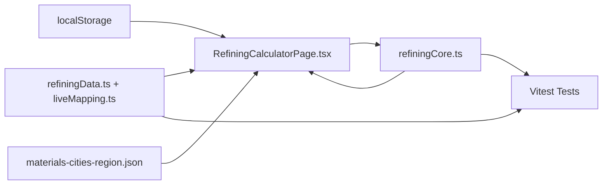
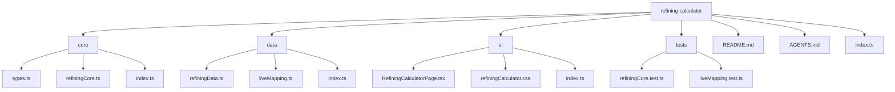
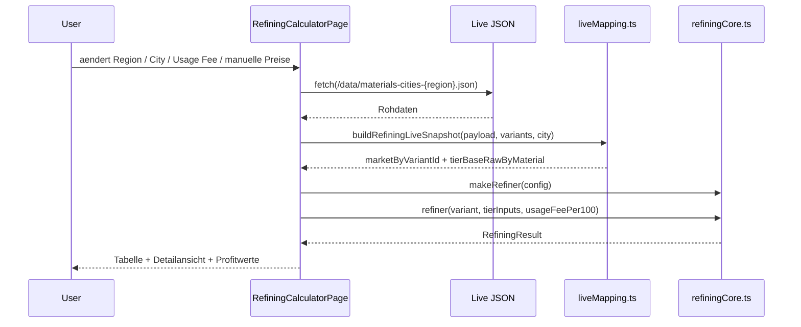
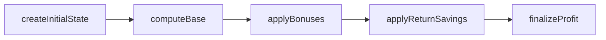
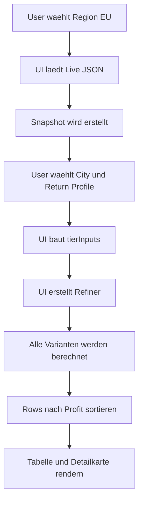

# Refining Calculator

## Projektziel
Der Refining Calculator berechnet fuer Albion-Refining-Varianten die wirtschaftlich relevanten Kennzahlen auf Basis von Marktpreisen, Return Rates, Focus und Stationsgebuehren.

Das Feature beantwortet vor allem diese Fragen:
- Wie teuer ist das Refining einer Variante?
- Wie stark reduziert Return Rate die effektiven Materialkosten?
- Wie veraendert Focus den Profit?
- Welche Variante ist unter den aktuellen Preisen am profitabelsten?

## Setup
- `npm install`
- `npm run dev`
- `npm run test`
- `npm run build`

## Feature-Uebersicht
Der Refining Calculator ist als `Functional Core / Imperative Shell` aufgebaut:
- `core/`: reine fachliche Berechnungen
- `data/`: statische Domain-Daten und Mapping von Live-Marktdaten
- `ui/`: React-Seite, Interaktionen, lokale Speicherung, Datenladen
- `tests/`: Vitest-Tests fuer Core und Datenmapping

## Architektur

## Verzeichnisstruktur

## Datei-fuer-Datei

### Root
- [index.ts](./index.ts)
  Exportiert das Feature ueber den UI-Einstieg.
- [README.md](./README.md)
  Beschreibt Struktur, Logik, FP-Entscheidungen und Tests.
- [AGENTS.md](./AGENTS.md)
  Interne Regeldatei fuer die Zielarchitektur und Rubric-Vorgaben.

### Core
- [core/types.ts](./core/types.ts)
  Enthaeelt alle Domain-Typen wie `City`, `Tier`, `Enchant`, `RefineVariant`, `RefiningInput`, `RefiningState`.
- [core/refiningCore.ts](./core/refiningCore.ts)
  Kern der Business-Logik. Diese Datei berechnet Materialkosten, Return Rate, Gebuehren, Gesamtkosten, Profit und Profit-Prozent.
- [core/index.ts](./core/index.ts)
  Zentraler Re-Export der Core-API.

### Data
- [data/refiningData.ts](./data/refiningData.ts)
  Definiert Materialien, Default-Preise, Multiplikatoren, Item-Werte und erzeugt alle Refining-Varianten.
- [data/liveMapping.ts](./data/liveMapping.ts)
  Wandelt Live-Marktdaten in das interne Snapshot-Format des Calculators um.
- [data/index.ts](./data/index.ts)
  Zentraler Re-Export der Datendateien.

### UI
- [ui/RefiningCalculatorPage.tsx](./ui/RefiningCalculatorPage.tsx)
  Die React-Seite. Sie laedt Daten, verwaltet UI-State, ruft den Core auf und rendert Tabelle, Filter und Detailansicht.
- [ui/refiningCalculator.css](./ui/refiningCalculator.css)
  Das Styling fuer den Refining Calculator.
- [ui/index.ts](./ui/index.ts)
  Exportiert die Seite.

### Tests
- [tests/refiningCore.test.ts](./tests/refiningCore.test.ts)
  Testet die reine Berechnungslogik.
- [tests/liveMapping.test.ts](./tests/liveMapping.test.ts)
  Testet das Mapping externer Live-Daten in das interne Modell.

## Datenfluss

## Berechnungslogik

### 1. Variantenmodell
Die Basis aller Berechnungen sind die Varianten aus [refiningData.ts](./data/refiningData.ts):
- Materialfamilie: `metal`, `wood`, `fiber`, `hide`
- Tier: `T4` bis `T8`
- Enchant: `.0` bis `.4`
- Multiplikator fuer Materialbedarf
- Item Value fuer die Gebuehrenberechnung
- Marktpreis bzw. Live-Preis

Jede Variante repraesentiert damit genau ein verfeinertes Produkt, etwa `T8.3 Metal Bar`.

### 2. Eingabedaten
Die Berechnung verwendet diese Inputs:
- Zielvariante
- Rohstoffpreise pro Material/Tier/Enchant
- `usageFeePer100`
- `nutritionFactor`
- Basis-Return-Rate
- City-Bonus
- Refining-Bonus
- Focus an/aus
- Focus-Return-Rate

Diese Werte werden ueber `createRefiningInput(...)` in ein sauberes `RefiningInput`-Objekt ueberfuehrt.

### 3. Berechnungspipeline
Die Hauptfunktion ist `calculateRefining(input)`.

Sie arbeitet als Pipeline:

Die Schritte im Detail:

#### `createInitialState`
Erzeugt einen neutralen Startzustand.
Initial vorhanden sind unter anderem:
- `returnRate = baseReturnRate`
- `outputAmount = 1`
- `revenue = variant.market`
- alle Kosten- und Profitwerte = `0`

#### `computeBase`
Berechnet die Grundwerte vor Return Rate:
- passenden Rohstoffpreis fuer die Variante finden
- Materialkosten berechnen
- Nutrition Cost berechnen
- Stationsgebuehr berechnen

#### `applyBonuses`
Erhoeht die Return Rate anhand von:
- City Bonus
- Refining Bonus
- Focus Bonus

Die Rate wird am Ende mit `clamp(...)` auf einen gueltigen Bereich begrenzt.

#### `applyReturnSavings`
Berechnet:
- Rueckgabewert der Materialien
- effektive Materialkosten nach Return Rate
- Gesamtkosten aus Materialkosten und Fee

#### `finalizeProfit`
Berechnet:
- `profit = revenue - totalCost`
- `profitPercent = profit / totalCost * 100`

## Kernformeln
- `nutritionCost = itemValue * nutritionFactor`
- `stationFee = (usageFeePer100 / 100) * nutritionCost`
- `grossMaterialCost = basePrice * multiplier`
- `returnedMaterialCost = grossMaterialCost * returnRate`
- `effectiveMaterialCost = grossMaterialCost - returnedMaterialCost`
- `totalCost = effectiveMaterialCost + refiningFee`
- `profit = revenue - totalCost`
- `profitPercent = totalCost > 0 ? (profit / totalCost) * 100 : 0`

## Live-Daten-Logik
Die Datei [liveMapping.ts](./data/liveMapping.ts) uebernimmt die Uebersetzung externer Marktpreise in das interne Modell.

### Aufgaben von `buildRefiningLiveSnapshot(...)`
- liest `payload.items`
- ordnet Preise ueber `itemId` den Refining-Varianten zu
- waehlt den Preis fuer eine konkrete Stadt
- oder den guenstigsten Wert, wenn `ALL` aktiv ist
- erzeugt zwei zentrale Maps:
  - `marketByVariantId`
  - `tierBaseRawByMaterial`

### Fallback-Verhalten
- Wenn fuer eine Variante kein Live-Preis existiert, wird auf den Default-Marktpreis der Variante zurueckgegriffen.
- Wenn fuer `.4` kein Preis existiert, versucht das Mapping `.3`, danach `.2`.
- Wenn kein Basispreis fuer ein Material/Tier existiert, wird `0` verwendet.

## UI-Logik
Die UI-Datei [RefiningCalculatorPage.tsx](./ui/RefiningCalculatorPage.tsx) ist die `imperative shell`.

Sie uebernimmt bewusst nicht die fachliche Berechnung, sondern:
- Auth und Userdaten initialisieren
- Region verwalten
- Live-Daten laden
- manuelle Preis-Overrides in `localStorage` speichern
- Filterzustand halten
- Eingaben in `tierInputs` umformen
- den `makeRefiner(...)`-Closure erzeugen
- Ergebnisse fuer alle Varianten berechnen und sortieren
- Tabelle und Detailansicht rendern

### Wichtige UI-States
- `region`
- `selectedCity`
- `returnRatePreset`
- `usageFeePer100`
- `manualOverrides`
- `liveMarketByVariantId`
- `liveRawByMaterialTierEnchant`
- `selectedRowKey`

### Sichtbare UI-Bereiche
- Header mit Navigation, Region und Account
- einklappbarer oberer Steuerungsbereich
- Materialpreis-Editor
- Filterblock
- Ergebnistabelle
- rechte Detailkarte fuer die selektierte Variante

## Functional Programming im Feature

### Pure Functions
In [refiningCore.ts](./core/refiningCore.ts) sind die wichtigsten pure functions:
- `calculateRefining`
- `applyBonuses`
- `computeReturnRate`
- `computeProfit`
- `computeStationFee`

Diese Funktionen:
- lesen keinen globalen Zustand
- schreiben keinen globalen Zustand
- haben keine Side Effects
- liefern bei gleichem Input immer denselben Output

### Immutability
- Core-Typen verwenden `readonly`
- Berechnungsschritte geben neue Objekte zurueck
- State wird nicht in-place veraendert

### Higher-Order Functions
- `pipe(...)`
- `withBonus(...)`

### Closures
- `makeRefiner(config) => (variant, tierInputs, usageFeePer100) => result`

### Recursion
- `sumRepeatedValue(...)` zeigt rekursive Summenbildung ohne mutable Schleife

## Rubric-Evidence
Die wichtigsten FP-Stellen sind im Code direkt mit `Rubric marker` kommentiert:
- [core/refiningCore.ts](./core/refiningCore.ts): Pure Functions, Immutability, HOF, Composition, Recursion, Closures
- [ui/RefiningCalculatorPage.tsx](./ui/RefiningCalculatorPage.tsx): Imperative Shell, Uebergabe an den Functional Core
- [tests/refiningCore.test.ts](./tests/refiningCore.test.ts): Determinismus, Immutability, Recursion, Pipeline-Test

## Testing
Die Tests decken diese Punkte ab:
- deterministische Berechnung
- Bonus-Anwendung
- Return Rate mit und ohne Focus
- Profit inkl. Negativfall
- Immutability
- rekursive Summenbildung
- komplette Pipeline ueber `makeRefiner(...)`
- Live-Mapping von Item-Preisen auf Varianten

## Beispielablauf

## Ergebnis des Features
Am Ende liefert der Refining Calculator pro Variante mindestens:
- `grossMaterialCost`
- `returnedMaterialCost`
- `effectiveMaterialCost`
- `refiningFee`
- `totalCost`
- `revenue`
- `profit`
- `profitPercent`
- `returnRate`

Damit ist das Feature fachlich komplett genug, um Refining-Entscheidungen datenbasiert zu vergleichen.
