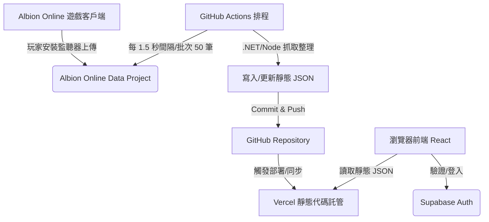

# 📊 Albion Blackmarket Reader

A free **market analytics & crafting profit suite** for *Albion Online*.
It pulls live market data, applies Albion's real in-game formulas (return rate, station fees, sales tax, focus cost) and tells you exactly **what is worth flipping, crafting, refining and cooking right now** — no spreadsheets required.

🔗 **Live:** [blackmarketreader.com](https://blackmarketreader.com) · 💬 **Discord:** [discord.gg/HF2Ctg73m5](https://discord.gg/HF2Ctg73m5)

---

## Why use it

Albion's economy is deep, but the math behind a "good deal" is tedious: return rate, focus efficiency, station usage fees, city bonuses and the sales tax all move the real profit far from the naive `sell − buy`. This tool does that math for you, on live prices, so you can:

- spot **Black Market flips** that actually clear a profit after tax,
- know **which items to craft** for the Black Market and how much you make per craft,
- decide **where and how to refine** — including when self-refining lower tiers beats buying them,
- find the **most profitable meals and potions** to cook, with focus and buffs accounted for.

Everything is priced from real market data per region (Americas / Europe / Asia) and per city, and results that look "too good to be true" (bad/stale data) are flagged so they don't mislead you.

---

## 🧰 The tools

### 🏴 Black Market Reader (Dashboard)
The classic flip-finder. Compares Black Market prices against city prices and surfaces profitable trades, with charts, search, city selection, min-profit filters and a profit-history graph. Region switch (Americas / Europe / Asia).

### ⚒️ Black Market Crafter
Shows which items are worth **crafting to sell on the Black Market**: craft cost, Black Market sell price and daily sales volume, sorted by profit. Click any row to jump straight into the Crafting Calculator with that item, its tier/enchant, Black Market as the sell target and your craft city pre-filled.

### 🧮 Crafting Calculator
Full profit breakdown for any craftable item: material cost with **resource return rate**, **focus cost**, **station usage fee**, sales + setup tax, and net profit / ROI. Supports every tier and enchant, per-city material and sell prices, Black Market sell prices, and the correct **local production bonus city** per item type.

### ♻️ Refining Calculator
Refining profit for ore, wood, fiber, hide and stone across all tiers and enchants — with city prices, **return-rate presets** (base / city / focus / custom), focus specs, and taxes. Includes a **Stacking mode** that works out when it is cheaper to refine the lower-tier materials yourself instead of buying them, and shows a **step-by-step path** for each item so you can see exactly what to craft first.

### 🍲 Food & Potion Crafter
Profit for meals and potions, including **fish-sauce / arcane-extract enchants**, per-recipe **focus cost** driven by your Cook / Alchemist spec levels, station fees, sales tax and per-item profit. Handles Avalonian recipes (non-returnable Avalonian Energy) and Caerleon / Brecilien production bonuses correctly.

---

## ✨ Accuracy features (across all tools)

- **Real in-game formulas** — station usage fee `CEIL(itemValue × 0.1125 × stationFee / 100)`, return rate `1 − 1/(1 + bonus)`, sales + setup tax (6.5 % premium / 10.5 % non-premium), all matched to the community reference workbook.
- **Focus cost model** — `baseFocus × 0.5^(efficiency / 10000)` with per-spec efficiency, verified exactly against the workbook.
- **Return-rate presets** — royal city, local production bonus, focus, or a custom value.
- **Unrealistic-profit flagging** — deals built on bad or stale market data are greyed out with a warning so fake profits don't fool you.
- **Live regional data** — Americas, Europe, and Asia, per city, refreshed automatically.

---

## 🧱 Tech Stack

- **Frontend:** React 18 + Vite 6 + TypeScript (`Albion_ProfitChecker/ui`), tested with Vitest
- **Backend / data sync:** .NET (C#) fetcher that pulls the public Albion market APIs
- **Auth:** Supabase (gated dashboard + user profiles)
- **Hosting & CI:** Vercel (static build) + GitHub Actions (scheduled data refresh & merges)

---

## 📁 Project Structure

```
Albion_Blackmarketreader/
├── .github/workflows/            # CI: market-data sync, merges, Discord changelog
├── CHANGELOG.md                  # Player-facing "what's new" (posted to Discord on release)
├── Albion_ProfitChecker/
│   ├── *.cs                      # .NET data fetcher + profit logic
│   └── ui/                       # React + Vite + TS app
│       ├── src/
│       │   ├── features/         # dashboard, bm-crafter, crafting-calculator,
│       │   │                     #   refining-calculator, food-potion-crafter
│       │   └── shared/           # auth, layout, shared UI
│       ├── public/data/          # generated market prices + recipe data (per region)
│       └── scripts/              # data-refresh scripts
└── README.md
```

---

## System Architecture



---

## 📦 Environment Setup

Set these in your Vercel project (used to generate runtime env at build time):

```
SUPABASE_URL
SUPABASE_ANON_KEY
```

Local development:

```bash
cd Albion_ProfitChecker/ui
npm install
npm run dev      # start the dev server
npm test         # run the Vitest suite
npm run build    # production build (with SEO prerender)
```

---

## 📈 Data Sync

- GitHub Actions refreshes **market data** on a schedule and merges results into the repo.
- Prices are split per region (US / EU / Asia) and per city under `ui/public/data/`.
- Recipe, crafting and refining datasets are derived from Albion item data and the reference workbook.

---

## 📬 Support

Open a **GitHub Issue** for questions or feature requests, join the **[Discord](https://discord.gg/HF2Ctg73m5)**, or email `blackmarketreader@gmail.com`.

---

## 📜 License / Disclaimer

This software is provided "as is", without warranty of any kind, either express or implied, including but not limited to merchantability or fitness for a particular purpose.

In no event shall the author be liable for any damages, data loss, or other issues arising directly or indirectly from the use of this software, regardless of whether such liability arises from contract, negligence, or any other legal theory.

---

## ⭐ Attribution

Albion Blackmarket Reader pulls data from the public Albion Online market APIs and visualizes it for easy profit inspection.
Not affiliated with Albion Online / Sandbox Interactive.
